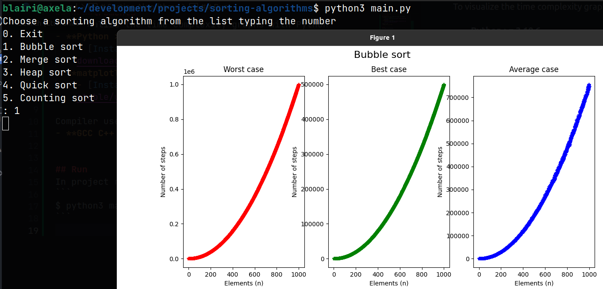
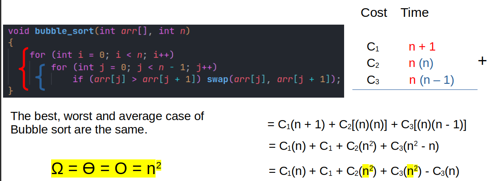
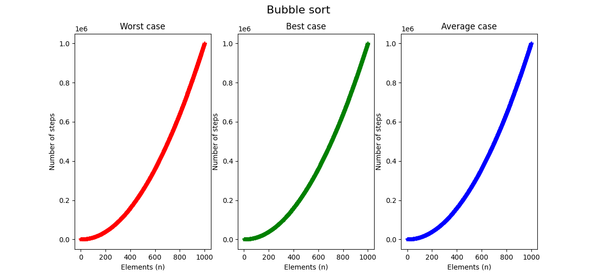
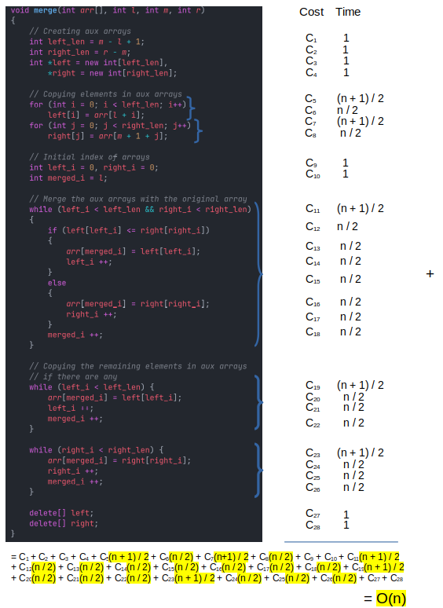
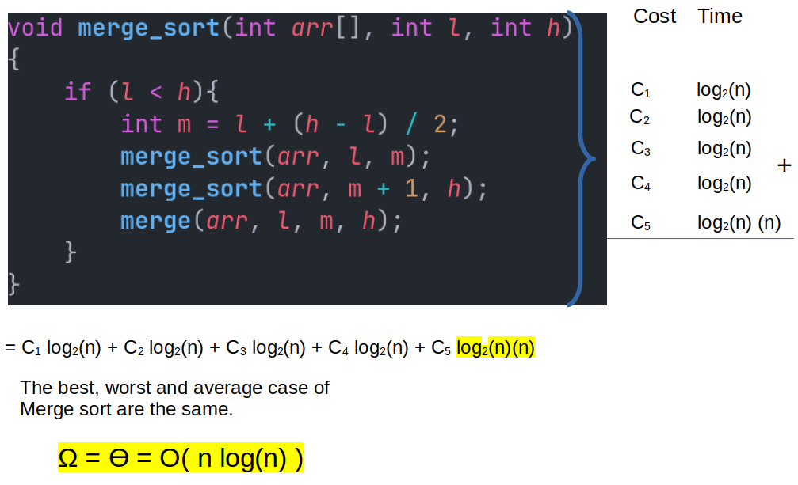
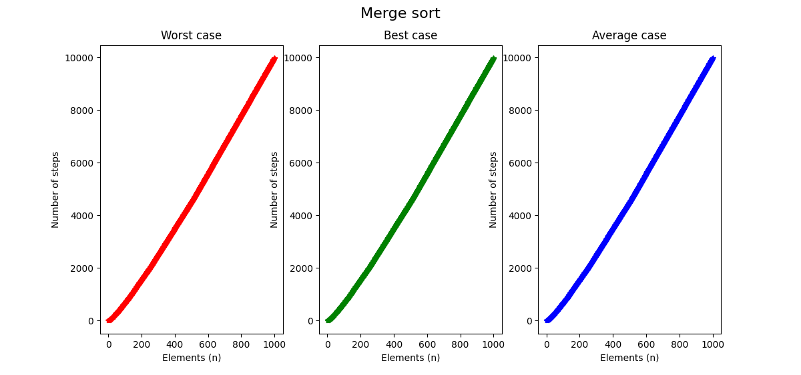
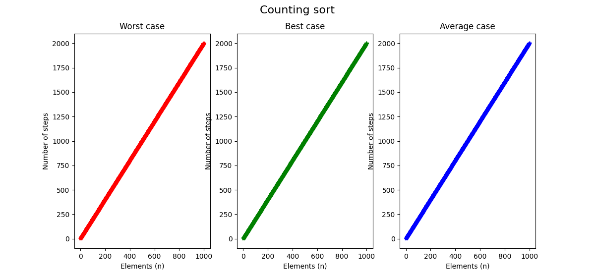

# Sorting Algorithms

## Summary
- [Requirements](#requirements)
- [Quick start](#quickstart)
- [Compile and run](#compileandrun)
- [How project works ?](#projectworks)
- [Analysis](#analysis)

## Requirements. <a name="requirements"></a>
To visualize the time complexity graphs with Python:
- **Python >= 3.10.6**
    - [Install latest version](https://www.python.org/downloads/)
- **matplotlib >= 3.5.2**
    - [Install latest version](https://matplotlib.org/stable/users/getting_started/)

Compiler used:
- **GCC C++ >= 11.3.0**


## Quick start. <a name="quickstart"></a>

Change the [project absolute path](https://github.com/Blairi/sorting-algorithms/blob/main/main.py#L3) in **main.py**

```
PATH = "{your path}/sorting-algorithms"
```
Example:
```
PATH = "/home/blairi/development/projects/sorting-algorithms"
```

In project root directory run:
```
$ python3 main.py
```

then, select the algorithm to visualize the time complexity graph.


## Compile and run <a name="compileandrun"></a>

if you make changes to C++ code...

Change the [project absolute path](https://github.com/Blairi/sorting-algorithms/blob/main/helpers/helpers.cpp#L6) in **helpers.cpp**

```
const std::string PATH = "{your path}/sorting-algorithms";
```
Example:
```
const std::string PATH = "/home/blairi/development/projects/sorting-algorithms";
```
<hr />

For **compile** run in project root directory:
### Unix / MacOS
```
$ g++ ./{algorithm}/{algorithm}.cpp ./helpers/helpers.h ./helpers/helpers.cpp -o ./out/{algorithm}
```
### Windows
```
g++ ./{algorithm}/{algorithm}.cpp ./helpers/helpers.h ./helpers/helpers.cpp -o ./out/{algorithm}.exe
```

Example:
```
$ g++ ./bubblesort/bubblesort.cpp ./helpers/helpers.h ./helpers/helpers.cpp -o ./out/bubblesort
```
<hr />

**Run**:
### Unix / MacOS
```
$ ./out/{algorithm}
```
### Windows
```
./out/{algorithm}.exe
```

Example:
```
$ ./out/bubblesort
```
## How project works ? <a name="projectworks"></a>
Implementations of the sorting algorithms in C++ are given a counter to count the number of steps they take to perform a sort. With counters we can check their efficiency.

Then we create 3 files for each algorithm, these correspond to the worst, best and average case of them. The number of instances and the number of steps taken to order those instances have been saved.

To display the plots we use Python with matplotlib, reading the generated files with C++.

# Analysis. <a name="analysis"></a>
Using RAM Model Analysis.
## Index
- [Bubble sort](#bubblesort)
- [Merge sort](#mergesort)
- [Counting sort](#countingsort)
## Bubble sort <a name="bubblesort"></a>


## Merge sort <a name="mergesort"></a>



## Counting sort <a name="countingsort"></a>

