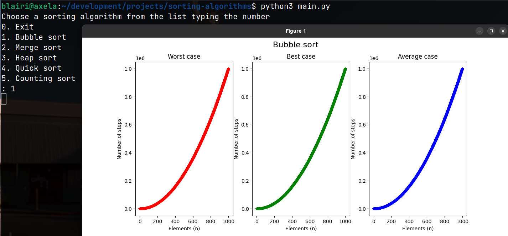

# Sorting Algorithms

## Summary
- [Requirements](#requirements)
- [Quick start](#quickstart)
- [Compile and run](#compileandrun)
- [Analysis](#analysis)

## Requirements. <a name="requirements"></a>
To visualize the time complexity graphs with Python:
- **Python >= 3.10.6**
    - [Install latest version](https://www.python.org/downloads/)
- **matplotlib >= 3.5.2**
    - [Install latest version](https://matplotlib.org/stable/users/getting_started/)

Compiler used:
- **GCC C++ >= 11.3.0**


## Quick start. <a name="quickstart"></a>

Change the [project absolute path](https://github.com/Blairi/sorting-algorithms/blob/main/main.py#L3) in **main.py**

```
PATH = "{your path}/sorting-algorithms"
```
Example:
```
PATH = "/home/blairi/development/projects/sorting-algorithms"
```

In project root directory run:
```
$ python3 main.py
```

then, select the algorithm to visualize the time complexity graph.


## Compile and run <a name="compileandrun"></a>

if you make changes to C++ code...

Change the [project absolute path](https://github.com/Blairi/sorting-algorithms/blob/main/helpers/helpers.cpp#L6) in **helpers.cpp**

```
const std::string PATH = "{your path}/sorting-algorithms";
```
Example:
```
const std::string PATH = "/home/blairi/development/projects/sorting-algorithms";
```
<hr />

For **compile** run in project root directory:
### Unix / MacOS
```
$ g++ ./{algorithm}/{algorithm}.cpp ./helpers/helpers.h ./helpers/helpers.cpp -o ./out/{algorithm}
```
### Windows
```
g++ ./{algorithm}/{algorithm}.cpp ./helpers/helpers.h ./helpers/helpers.cpp -o ./out/{algorithm}.exe
```

Example:
```
$ g++ ./bubblesort/bubblesort.cpp ./helpers/helpers.h ./helpers/helpers.cpp -o ./out/bubblesort
```
<hr />

**Run**:
### Unix / MacOS
```
$ ./out/{algorithm}
```
### Windows
```
./out/{algorithm}.exe
```

Example:
```
$ ./out/bubblesort
```
## Analysis. <a name="analysis"></a>
## Bubble sort
